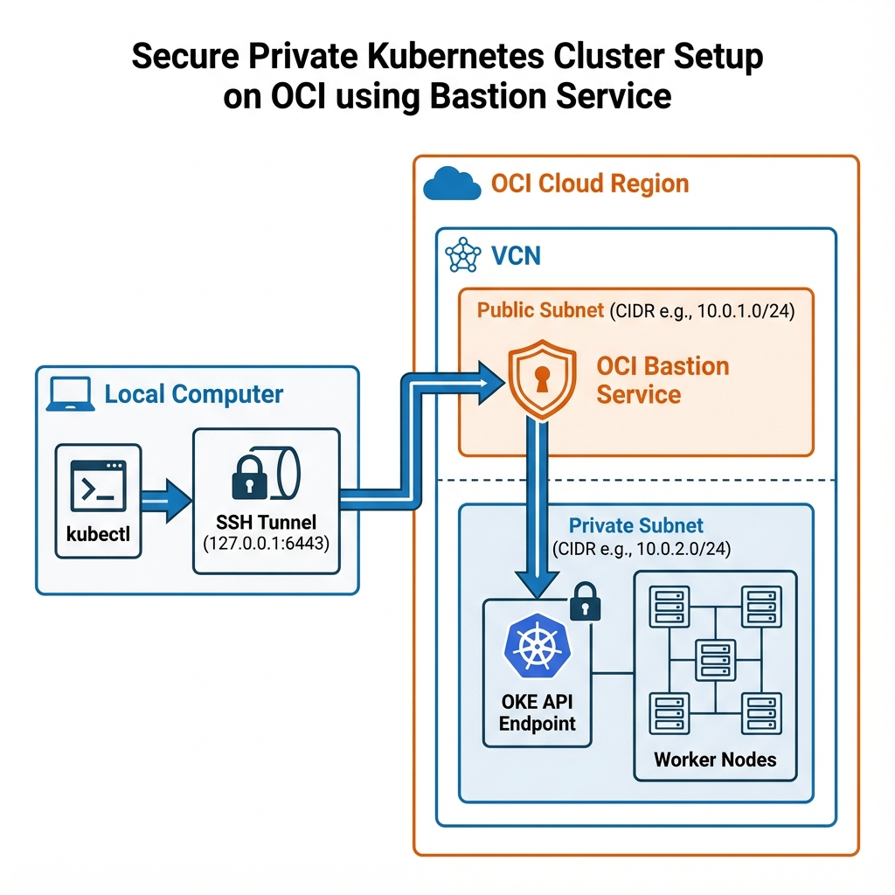

# OCI Free Tier Kubernetes Infrastructure

This directory contains Terraform configuration to provision a fully private, secure Oracle Kubernetes Engine (OKE) cluster that fits entirely within the **OCI Always Free Tier** limits.

## Architecture



*   **Cluster**: API Endpoint is **Private** (No public internet access).
*   **Nodes**: Worker nodes are in a **Private Subnet** (No public IPs).
*   **Access**: Secure SSH Tunnel via **OCI Managed Bastion Service** (Free).

## Resources Created

*   **VCN**: Virtual Cloud Network (10.0.0.0/16) with Public/Private subnets.
*   **OKE Cluster**: "Basic" type cluster (Free).
*   **Node Pool**: 2x Ampere A1 instances (2 OCPUs, 12GB RAM each) running OKE-optimized images.
*   **Bastion**: OCI Managed Bastion Service (Zero cost, no VM management).

## Prerequisites

1.  **OCI Account**: You need an active Oracle Cloud account.
2.  **OCI CLI**: Installed and configured on your machine.
    *   Install: `brew install oci-cli` (macOS) or see [official docs](https://docs.oracle.com/en-us/iaas/Content/API/SDKDocs/cliinstall.htm).
    *   Configure: Run `oci setup config` and follow the prompts.
3.  **Terraform**: Installed on your machine.
4.  **OCI Credentials**: You need your Tenancy OCID, User OCID, Fingerprint, and Private Key.

## Quick Start (Makefile)

We use a `Makefile` to simplify all commands.

### 1. Initialize
```bash
make init
```

### 2. Configure Credentials
You need to set `TF_VAR_compartment_ocid`. You can add this to your `~/.bashrc` or `~/.zshrc`:
```bash
export TF_VAR_compartment_ocid="<your-tenancy-ocid>"
export TF_VAR_ssh_public_key=$(cat ~/.ssh/id_rsa.pub)
```

### 3. Deploy
```bash
make apply
```
*   Review the plan and type `yes`.
*   This will create the Cluster, Nodes, and Bastion Service.

### 4. Generate Credentials
Since this is a fresh cluster, you need to generate the `kubeconfig` and set up the local tunnel alias.
```bash
make kubeconfig
```

### 5. Connect (Important!)
Since the cluster is private, you cannot connect directly. You must open a tunnel.

**1. Open the Tunnel:**
```bash
make connect
```
*   This automatically creates a Bastion Session (30 minutes).
*   It opens a secure SSH tunnel forwarding `localhost:6443` -> `Cluster`.
*   **Keep this terminal open.**

**2. Verify Access:**
In a new terminal:
```bash
kubectl get nodes
```
(Your kubeconfig is automatically set up to use `localhost:6443`).

## Configuration

### Custom SSH Keys
If you are not using the default `~/.ssh/id_rsa`, you can override them:
```bash
export SSH_PRIVATE_KEY="/path/to/key"
export SSH_PUBLIC_KEY="/path/to/key.pub"
make connect
```

## Cleanup

To destroy all resources:
```bash
make destroy
```

## Troubleshooting

*   **"Out of host capacity"**: This is common in Free Tier regions. If `make apply` fails on node creation, just wait and retry later. The rest of the infra will stay intact.
*   **SSH Permission Denied**: Ensure your `~/.ssh/id_rsa.pub` matches what you provided to Terraform.
